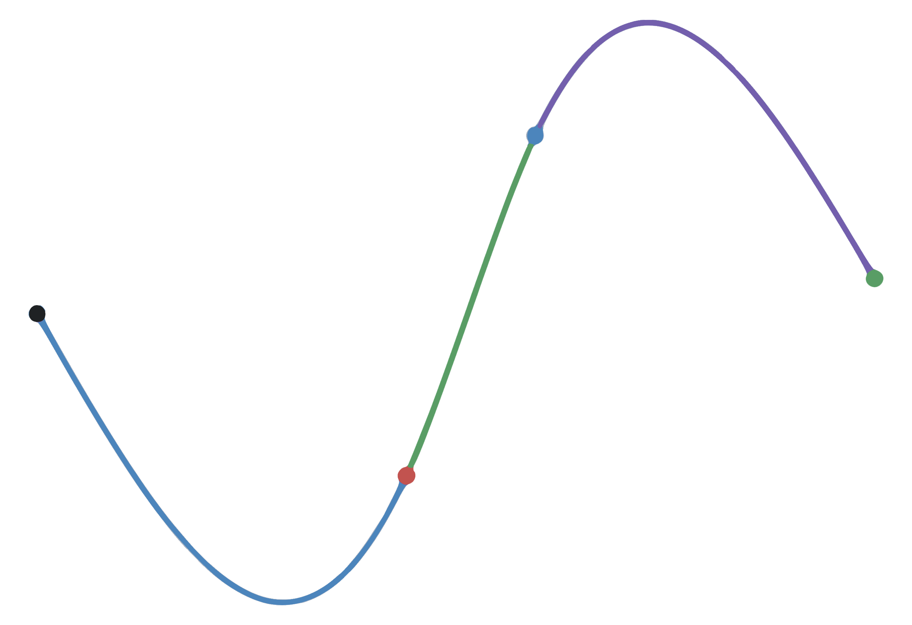
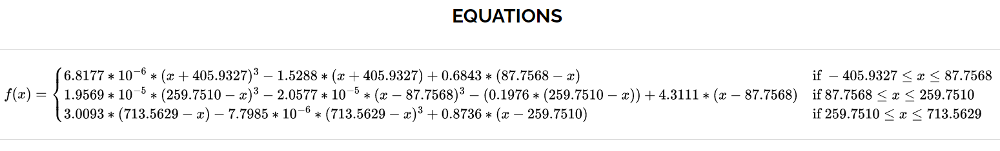
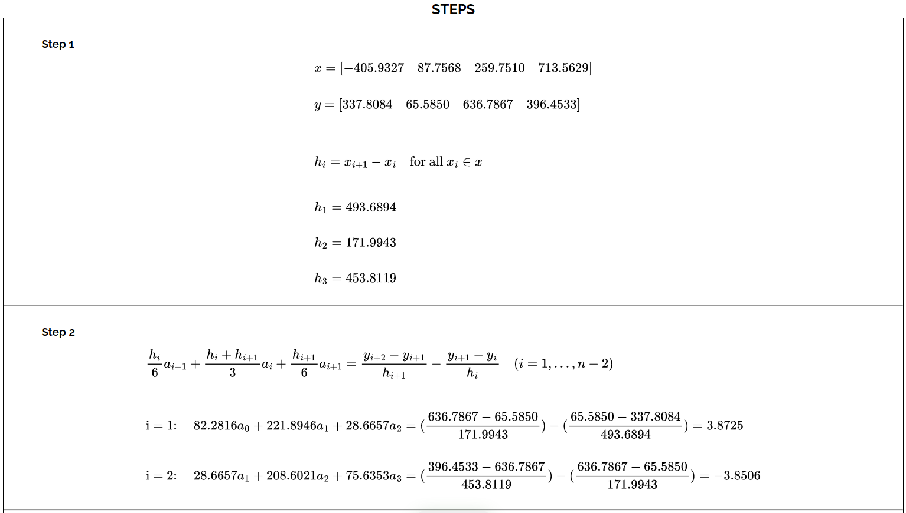
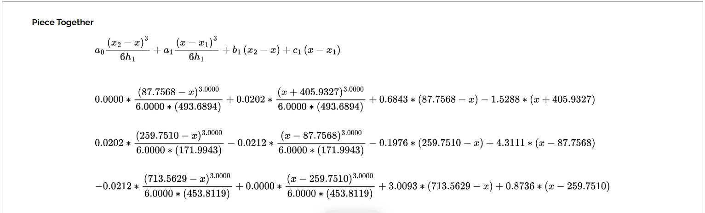

# Cubic Spline Interpolation Visualizer

## Overview
This program uses the cubic spline formula to solve for interpolating polynomials that go through the provided points. It will accept any amount of points greater than 3. This program is different from other programs as it not only graphs each polynomial and point, but it also provides the steps towards the solution.

<!-- PROJECT LOGO -->
<br />
<p align="center">
  <a href="public/images/logo-80.png">
    
  </a>

  <h3 align="center">Cubic Spline Interpolation</h3>

  <p align="center">
    An awesome interpolator alternative!
    <br />
    <a href="#">View Demo</a>
    ·
    <a href="https://github.com/Alejandro-Vega/Cubic-Spline-Interpolation-Visualizer/issues">Report Bug</a>
    ·
    <a href="https://github.com/Alejandro-Vega/Cubic-Spline-Interpolation-Visualizer/issues">Request Feature</a>
  </p>
</p>


<!-- TABLE OF CONTENTS -->
<details open="open">
  <summary>Table of Contents</summary>
  <ol>
    <li>
      <a href="#about-the-project">About The Project</a>
      <ul>
        <li><a href="#built-with">Built With</a></li>
      </ul>
    </li>
    <li>
      <a href="#getting-started">Getting Started</a>
      <ul>
        <li><a href="#prerequisites">Prerequisites</a></li>
        <li><a href="#installation">Installation</a></li>
      </ul>
    </li>
    <li><a href="#usage">Usage</a></li>
    <li><a href="#roadmap">Roadmap</a></li>
    <li><a href="#contributing">Contributing</a></li>
    <li><a href="#license">License</a></li>
    <li><a href="#contact">Contact</a></li>
    <li><a href="#acknowledgements">Acknowledgements</a></li>
  </ol>
</details>

  
<!-- ABOUT THE PROJECT -->
## About The Project

[![Product Name Screen Shot][product-screenshot]](public/images/example-graph1.png)

There are currently not many visualizer calculators for the numerical analysis field in math. The topics can be difficult to grasp. 

Here's why I felt it needed to created:
* Not many calculators online to solve such a problem
* No calculator online shows the steps towards solving the problem
* Helpful for students and math enthusiasts to see what the result for such a problem will look like
* Easy to use interface, and friendly towards users who know nothing about the subject

Although, there is more than one way to implement the Cubic Spline Interpolation, this is one of the more popular methods for solving the problem.  

A list of commonly used resources that I find helpful are listed in the acknowledgements.

### Built With

A server is created using Express that handles the calculations for solving the Cubic Spline Interpolation problem. The server returns relevant variable used within the formula, along with the solution. It also uses the Desmos API to graph and visualize the results.
* [HTML]
* [CSS]
* [JavaScript]
* [Express](https://expressjs.com)
* [Desmos API](https://www.desmos.com/api)


<!-- GETTING STARTED -->
## Getting Started

This is an example of how you may give instructions on setting up your project locally.
To get a local copy up and running follow these simple example steps.

### Prerequisites

This is an example of how to list things you need to use the software and how to install them.
* npm
  ```sh
  npm install npm@latest -g
  ```

### Installation

1. Clone the repo
   ```sh
   git clone https://github.com/Alejandro-Vega/Cubic-Spline-Interpolation-Visualizer.git
   ```
2. Install NPM packages
   ```sh
   npm install
   ```


<!-- USAGE EXAMPLES -->
## Usage

To use the program you have the following options:
* Insert your own coordinate points 
* Generate random coordinate points
* Add a new field for an additional coordinate point
* Modify the number of decimals that will be displayed in the steps and within the graph (At least 4 is recommended)

If you insert your own points, you must click "Calculate" afterwards so the program begins the computation and prepares the results. Otherwise, generate should work straight away after clicking the button and immediately show the results of the randomly generated points. If you want to add more points, simply click on the "Add Point" option above the "Calculate" button.  

[![Cubic Spline Interpolation Visualizer][input-example-screenshot]](public/images/example-input1.png)

The program is not currently limited to the number of possible points it can handle. Although, it is expected that the more points that are provided the more computation power will be needed to calculate the results. Delay may vary depending on the computation.

<p>
  
</p>
<p>
  
</p>
<p>
  
</p>
<p>
  
</p>
<p>
  
</p>
<p>
  
</p>
<p>
  
</p>


<!-- CONTRIBUTING -->
## Contributing

Contributions are what make the open source community such an amazing place to be learn, inspire, and create. Any contributions you make are **greatly appreciated**.

1. Fork the Project
2. Create your Feature Branch (`git checkout -b feature/AmazingFeature`)
3. Commit your Changes (`git commit -m 'Add some AmazingFeature'`)
4. Push to the Branch (`git push origin feature/AmazingFeature`)
5. Open a Pull Request


<!-- LICENSE -->
## License

Distributed under the MIT License. See `LICENSE` for more information.


<!-- CONTACT -->
## Contact

Alejandro Vega - [LinkedIn](https://www.linkedin.com/in/alejandro--vega/) - AlejandroVega@alejandrovega.dev

Project Link: [https://github.com/Alejandro-Vega/Cubic-Spline-Interpolation-Visualizer](https://github.com/Alejandro-Vega/Cubic-Spline-Interpolation-Visualizer)


<!-- ACKNOWLEDGEMENTS -->
## Acknowledgements
* [AlgebraJS](https://algebra.js.org)
* [MathJS](https://mathjs.org)
* [Multer](https://www.npmjs.com/package/multer)
* [rref](https://www.npmjs.com/package/rref)


<!-- MARKDOWN LINKS & IMAGES -->
<!-- https://www.markdownguide.org/basic-syntax/#reference-style-links -->
[contributors-shield]: https://img.shields.io/github/contributors/othneildrew/Best-README-Template.svg?style=for-the-badge
[contributors-url]: https://github.com/othneildrew/Best-README-Template/graphs/contributors
[forks-shield]: https://img.shields.io/github/forks/othneildrew/Best-README-Template.svg?style=for-the-badge
[forks-url]: https://github.com/othneildrew/Best-README-Template/network/members
[stars-shield]: https://img.shields.io/github/stars/othneildrew/Best-README-Template.svg?style=for-the-badge
[stars-url]: https://github.com/othneildrew/Best-README-Template/stargazers
[issues-shield]: https://img.shields.io/github/issues/othneildrew/Best-README-Template.svg?style=for-the-badge
[issues-url]: https://github.com/othneildrew/Best-README-Template/issues
[license-shield]: https://img.shields.io/github/license/othneildrew/Best-README-Template.svg?style=for-the-badge
[license-url]: https://github.com/othneildrew/Best-README-Template/blob/master/LICENSE.txt
[linkedin-shield]: https://img.shields.io/badge/-LinkedIn-black.svg?style=for-the-badge&logo=linkedin&colorB=555
[linkedin-url]: https://linkedin.com/in/othneildrew
[product-screenshot]: public/images/example-graph1.png
[input-example-screenshot]: public/images/example-input1.png
[result-example-screenshot]: public/images/example-result1.png
[step1-example-screenshot]: public/images/example-step1.png
[step2-example-screenshot]: public/images/example-step2.png
[step3-example-screenshot]: public/images/example-step3.png
[step4-example-screenshot]: public/images/example-step4.png
[step5-example-screenshot]: public/images/example-step5.png
[step6-example-screenshot]: public/images/example-step6.png